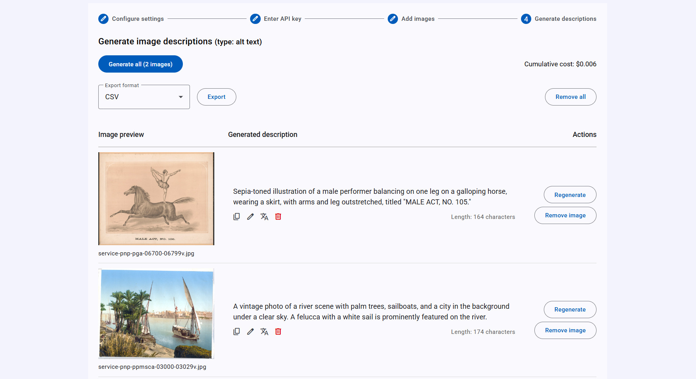

# aBBi – AI-generated image descriptions

aBBi (“AI-bildbeskrivningar”) is a web app for generating image descriptions (e.g. alt texts) using AI. It currently supports OpenAI and Google models with vision capabilities. You need an OpenAI or Google API key to use the tool. It is a frontend app without the need of a backend.

The app is built on [Angular][angular] and uses [Angular Material][material] web components.

<p>
  <a href="https://github.com/angular/angular"></a>
</p>

Author: Sebastian Köhler (2024)

<hr>

## Screenshot of the app



Images in the screenshot: Library of Congress public domain.

<hr>

## Changelog

[Learn about the latest improvements][changelog].

## Development Setup

### Prerequisites

1. Install [Node.js][node.js] which includes [npm][npm]. The app is compatible with Node `^20.19.0`, `^22.12.0` and `^24.0.0` (based on [Angular 20 compatibility][angular_version_compatibility]). Check your Node version with:

```
Node --version
```

2. Install the [Angular CLI][angular_cli] globally:

```
npm install -g @angular/cli
```

3. [Clone][clone_repository] the repository locally and `cd` into the folder. On Windows you can use [GitHub Desktop][github_desktop] or [Git Bash][git_bash] (see [tutorial on Git Bash][git_bash_tutorial]).

4. Install dependencies:

```
npm install
```

### Run local development server

To build and serve the application on a development server, run:

```
npm start
```

Open your browser on http://localhost:4200/. The app will automatically rebuild and reload if you change any of the source files.

## Building and deployment

On each commit in the `main` branch a Docker image with the tag `main` is automatically built using GitHub Actions and stored in the [GitHub Container Registry][abbi_ghcr].

On each release a Docker image with the chosen release tag and the tag `latest` is automatically built using GitHub Actions and also stored in the [GitHub Container Registry][abbi_ghcr].

To deploy the latest image, you can clone the repository or just [`compose.yaml`][compose.yaml] and run:

```
docker compose up -d
```

## Keeping the app up-to-date

### Dependencies

Most of the dependencies are part of the Angular framework (`@angular/`). These should be updated with the command:

```
ng update @angular/cli @angular/core @angular/cdk @angular/material
```

When updating to a new major version of Angular, check the update guide first: <https://angular.dev/update-guide>. Also update the Angular major version number specified in [`Dockerfile`][dockerfile].

Other dependencies can be updated by bumping the version number in [`package.json`][package.json] and running:

```
npm install
```

### Node.js and nginx Docker images

[Node.js][node.js] and [nginx][nginx] Docker images are used in the build process. To update these, change the tags specified in both [`Dockerfile`][dockerfile] and in [`docker-build-and-push.yml`][docker_build].

### Modifying available AI-models, languages and prompt types

The available AI-models are defined in [`src/assets/config/models.ts`][models.ts]. Currently, OpenAI and Google (Gemini) models are supported.

The available description languages and prompt types are defined in [`src/assets/config/prompts.ts`][prompts.ts]. In the prompt templates, the strings `{{FILENAME}}` and `{{DESC_LENGTH}}` are replaced with the image filename and desired approximate description length, respectively.


[abbi_ghcr]: https://github.com/slsfi/abbi-ng-ai-image-descriptor/pkgs/container/abbi-ng-ai-image-descriptor
[angular]: https://angular.dev/
[angular_cli]: https://angular.dev/cli
[angular_version_compatibility]: https://angular.dev/reference/versions
[changelog]: CHANGELOG.md
[clone_repository]: https://docs.github.com/en/repositories/creating-and-managing-repositories/cloning-a-repository
[compose.yaml]: compose.yaml
[docker_build]: .github/workflows/docker-build-and-push.yml
[dockerfile]: Dockerfile
[git_bash]: https://gitforwindows.org/
[git_bash_tutorial]: https://www.atlassian.com/git/tutorials/git-bash
[github_desktop]: https://desktop.github.com/
[material]: https://material.angular.io/
[models.ts]: src/assets/config/models.ts
[nginx]: https://nginx.org/
[node.js]: https://nodejs.org/
[npm]: https://www.npmjs.com/get-npm
[package.json]: package.json
[prompts.ts]: src/assets/config/prompts.ts
[SLS]: https://www.sls.fi/en
